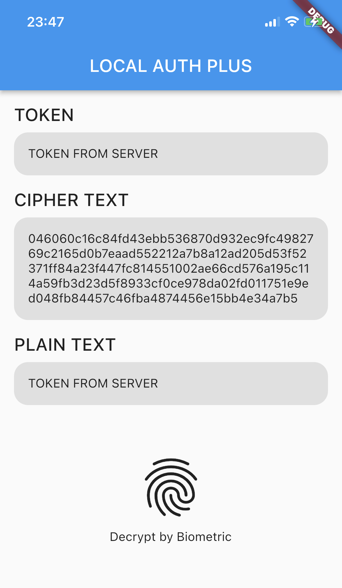

# local_auth_crypto

[](https://pub.dartlang.org/packages/local_auth_crypto)

Android and iOS devices to allow Local Authentication + Cryptography via Biometric.



## Features

#### New instance

```dart
final localAuthCrypto = LocalAuthCrypto.instance;
```

#### Encrypt

```dart
await localAuthCrypto.encrypt(message);
```

### PromptInfo

```dart
BiometricPromptInfo(
  title: 'BIOMETRIC',
  subtitle: 'Please scan biometric to decrypt',
  negativeButton: 'CANCEL',
);
```

### Decrypt

```dart
await localAuthCrypto.authenticate(promptInfo, cipherText);
```

## Getting started

It is really easy to use! You should ensure that you add the `local_auth_crypto` as a dependency in your flutter project.

```yaml
local_auth_crypto: "^1.0.0"
```

## Usage

### Flutter

- Encrypt

```dart
final localAuthCrypto = localAuthCrypto.instance;

final message = 'TOKEN';
final cipherText = await localAuthCrypto.encrypt(message);
```

- Decrypt

```dart
final localAuthCrypto = localAuthCrypto.instance;

final promptInfo = BiometricPromptInfo(
  title: 'BIOMETRIC',
  subtitle: 'Please scan biometric to decrypt',
  negativeButton: 'CANCEL',
);
final plainText = await localAuthCrypto.authenticate(promptInfo, cipherText);
```

### Android

- Update code in `MainActivity.kt` file

```kotlin
import io.flutter.embedding.android.FlutterFragmentActivity

class MainActivity : FlutterFragmentActivity()
```

- Add use-permissions in `AndroidManifest.xml` file

```xml
<uses-permission android:name="android.permission.USE_BIOMETRIC" />
```

### iOS

- Add privacy in `info.plist` file

```xml
<dict>
  <key>NSFaceIDUsageDescription</key>
  <string>This application wants to access your TouchID or FaceID</string>
</dict>
```