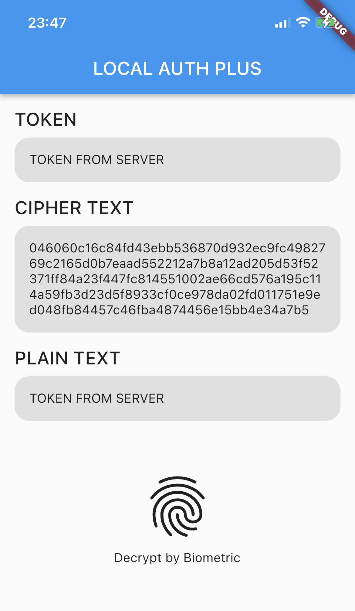

# local_auth_crypto 🔐

[](https://pub.dartlang.org/packages/local_auth_crypto)
[](https://flutter.dev)
[](https://flutter.dev/multi-platform)
[](https://opensource.org/licenses/MIT)

> Secure data encryption and decryption using biometric authentication for Flutter (Android & iOS).



## ✨ Features

- 🔒 **Biometric Encryption** - Encrypt data using biometric authentication
- 🔓 **Secure Decryption** - Decrypt data only with valid biometric authentication
- 📱 **Cross-Platform** - Works seamlessly on both Android and iOS
- 🛡️ **Hardware Security** - Leverages device secure hardware
- 🎯 **Simple API** - Easy to use encryption/decryption interface
- ⚡ **Fast & Efficient** - Native implementation for optimal performance

## 📦 Installation

Add to your `pubspec.yaml`:

```yaml
dependencies:
  local_auth_crypto: ^1.1.2
```

Then run:
```bash
flutter pub get
```

## 🚀 Quick Start

### 1. Import the Package

```dart
import 'package:local_auth_crypto/local_auth_crypto.dart';
```

### 2. Initialize

```dart
final localAuthCrypto = LocalAuthCrypto.instance;
```

### 3. Encrypt Data

```dart
final message = 'SECRET_TOKEN';
final cipherText = await localAuthCrypto.encrypt(message);
```

### 4. Decrypt Data

```dart
final promptInfo = BiometricPromptInfo(
  title: 'BIOMETRIC',
  subtitle: 'Please scan biometric to decrypt',
  negativeButton: 'CANCEL',
);

final plainText = await localAuthCrypto.authenticate(promptInfo, cipherText);
```

## 📱 Platform Setup

### 🤖 Android Setup

1. Update `MainActivity.kt`:

```kotlin
import io.flutter.embedding.android.FlutterFragmentActivity

class MainActivity : FlutterFragmentActivity()
```

2. Add permissions to `AndroidManifest.xml`:

```xml
<uses-permission android:name="android.permission.USE_BIOMETRIC" />
```

### 🍎 iOS Setup

Add to your `Info.plist`:

```xml
<dict>
  <key>NSFaceIDUsageDescription</key>
  <string>This application wants to access your TouchID or FaceID</string>
</dict>
```

## 📚 API Reference

### Encryption Methods

#### encrypt
```dart
Future<CipherText> encrypt(String message)
```
Encrypts a string message and returns encrypted cipher text.

#### authenticate
```dart
Future<String> authenticate(BiometricPromptInfo promptInfo, CipherText cipherText)
```
Authenticates user with biometrics and decrypts the cipher text.

### BiometricPromptInfo

Configure the biometric prompt:

```dart
BiometricPromptInfo({
  required String title,
  required String subtitle,
  required String negativeButton,
  String? description,
  bool confirmationRequired = true,
})
```

## 💡 Complete Example

```dart
import 'package:local_auth_crypto/local_auth_crypto.dart';

class SecureDataManager {
  final localAuthCrypto = LocalAuthCrypto.instance;

  Future<void> saveSecureData(String sensitiveData) async {
    try {
      // Encrypt sensitive data
      final cipherText = await localAuthCrypto.encrypt(sensitiveData);

      // Save encrypted data to storage
      await saveToSecureStorage(cipherText);

      print('Data encrypted and saved successfully');
    } catch (e) {
      print('Encryption failed: $e');
    }
  }

  Future<String?> retrieveSecureData() async {
    try {
      // Retrieve encrypted data from storage
      final cipherText = await getFromSecureStorage();

      // Create prompt for biometric authentication
      final promptInfo = BiometricPromptInfo(
        title: 'Authentication Required',
        subtitle: 'Please authenticate to access secure data',
        negativeButton: 'Cancel',
        description: 'Your biometric data is required to decrypt sensitive information',
      );

      // Authenticate and decrypt
      final decryptedData = await localAuthCrypto.authenticate(
        promptInfo,
        cipherText,
      );

      return decryptedData;
    } catch (e) {
      print('Decryption failed: $e');
      return null;
    }
  }
}
```

## 🔍 Error Handling

Handle common scenarios:

```dart
try {
  final result = await localAuthCrypto.authenticate(promptInfo, cipherText);
  // Handle successful authentication
} on PlatformException catch (e) {
  switch (e.code) {
    case 'auth_failed':
      print('Authentication failed');
      break;
    case 'auth_canceled':
      print('Authentication canceled by user');
      break;
    case 'not_available':
      print('Biometric authentication not available');
      break;
    case 'not_enrolled':
      print('No biometric data enrolled');
      break;
    default:
      print('Unknown error: ${e.message}');
  }
}
```

## 🔒 Security Best Practices

1. **Sensitive Data Only**: Use this package only for sensitive data that requires biometric protection
2. **Error Handling**: Always implement proper error handling for authentication failures
3. **Fallback Options**: Provide alternative authentication methods when biometrics are unavailable
4. **Data Validation**: Validate decrypted data to ensure integrity
5. **Key Management**: Never store encryption keys in plain text

## 📊 Supported Biometric Types

| Platform | Supported Biometrics |
|----------|---------------------|
| Android  | Fingerprint, Face recognition, Iris |
| iOS      | Touch ID, Face ID |

## 🤝 Contributing

Contributions are welcome! Please feel free to submit a Pull Request.

## 📄 License

This project is licensed under the MIT License - see the [LICENSE](LICENSE) file for details.

## 💖 Support the Project

If you find this package helpful, please consider supporting it:

[](https://www.buymeacoffee.com/prongbang)

## 🔗 Related Projects

- [local_auth_signature](https://github.com/prongbang/local_auth_signature)
- [flutter_biometric_auth](https://pub.dev/packages/flutter_biometric_auth)
- [biometric_storage](https://pub.dev/packages/biometric_storage)

---
